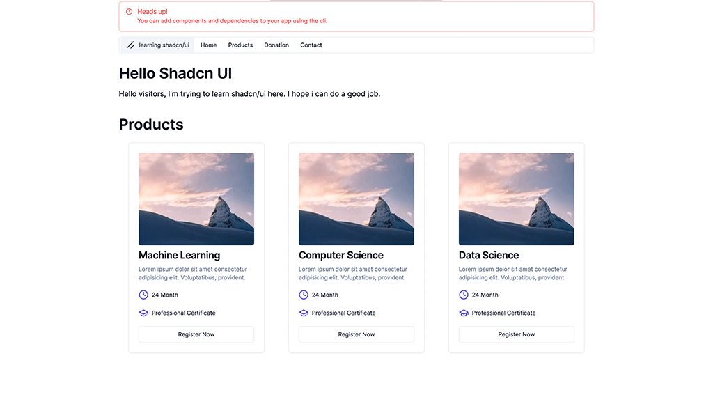

# Learn shadcn/ui with me v2

This is the second version of my project using the Shadcn UI library. This version includes significant improvements and refinements.

## What's New in v2?

### Improved Design

- The overall design has been revamped for a more modern and aesthetic appearance.
- Enhanced UI/UX elements to provide a better user experience.

### Bug Fixes

- Addressed and resolved numerous bugs from the previous version to ensure smoother performance and reliability.

### Optimized File Structure

- Reorganized the file structure for better readability and maintainability.
- Grouped related files and components together for ease of access and management.

### Code Cleanup

- Removed unnecessary code to streamline the application and improve performance.
- Refactored existing code to follow best practices and enhance code quality.

### Framer Motion Animations

- Added smooth animations using the Framer Motion library for a more dynamic user experience.

### Release Page Integration

- All versions published on GitHub are now fetched via the GitHub API and displayed on the Releases page of the site.
- This allows users to easily view the details of both current and past versions directly from the website.

### Demo

Check out the [v2 Demo](https://learning-shadcn-ui.vercel.app/).

## v1 Overview



This was my first experience with the Shadcn UI library. I was experimenting and learning how to use it.

### Design and Features

- Basic design with core functionality.
- Initial layout and components setup.

## Installation

To get started with this project, clone the repository and install the necessary dependencies:

```bash
git clone https://github.com/talhaozbek61/shadcn-ui.git
cd shadcn-ui
npm install
```
